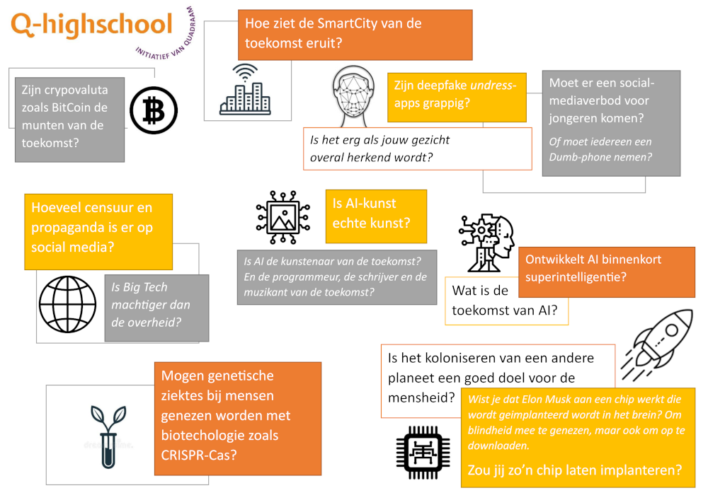

# Voorbereiding

Als voorbereiding op de dagmodule hebben we drie opdrachten voor je. Neem je uitwerkingen mee naar de dagmodule!

1. Bekijk de onderwerpen die te maken hebben filosofie van de technologie. Welke lijken jou interessant om verder in te duiken? Kruis er drie aan.
   
   
   
   *Klik [hier](assets/Onderwerpen.pdf) of op de afbeelding om een grotere versie te bekijken.*

Tijdens de dagmodule gaan jullie aan de slag als een filosofisch-technologische denktank over een van die onderwerpen. In de ochtend gaan we oefenen met die vorm aan de hand van het onderwerp **autonome wapens**. Begin dit jaar vond in Spanje de [REAIM](https://www.exteriores.gob.es/en/REAIM2026/Paginas/default.aspx) top plaats, waar vertegenwoordigers van over de hele wereld probeerden het eens te worden over het gebruik van AI voor militaire doeleinden. Het was ook een van de onderwerpen in de [recente botsing tussen Anthropic en de Amerikaanse overheid](https://archive.is/i04aj). Voor de denktank de vraag: wat is ons advies voor de regulering van autonome wapens?

2. Bekijk/lees de volgende vier bronnen over autonome wapens:

   - [Bright (via YouTube): Killer robots: deze technologie is levensgevaarlijk!](https://www.youtube.com/watch?v=ijom1wElgTw) (2020)
   - [NPO Kennis: Hoe moeten we omgaan met slimme wapens?](https://npokennis.nl/longread/7871/hoe-moeten-we-omgaan-met-slimme-wapens) (2026)
   - [NOS: Militaire top moet leiden tot 'ethisch AI-gebruik'](https://nos.nl/artikel/2600967-militaire-top-moet-leiden-tot-ethisch-ai-gebruik) (2026)
   - [RU: Als AI de trekker overhaalt: hoe valt autonome oorlogsvoering te reguleren?](https://www.ru.nl/over-ons/nieuws/als-ai-de-trekker-overhaalt-hoe-valt-autonome-oorlogsvoering-te-reguleren) (2025)

   Het is belangrijk dat iedereen weet waar het precies over hebben. Wat is volgens jou de definitie van een autonoom wapen?

3. Kies *één van de* vervolgopdrachten over autonome wapens hieronder en voer deze uit. Het resultaat deel je met de andere deelnemers tijdens de dagmodule, dus schrijf je antwoorden duidelijk op!

   1. Vat de informatie uit de vier bovenstaande bronnen samen.

   2. Zoek een extra bron over autonome wapens en maak een samenvatting. Zoek bijvoorbeeld een bron over verschillende soorten autonome wapens, over actueel nieuws of een bron met een duidelijk standpunt.

      De officiële term is "autonome wapensystemen (AWS)", maar "killer robots" is ook een veelgebruikte term. Zoek eens op "Stop Killer Robots" als je een duidelijk standpunt zoekt, of op "Jonathan Kwik" voor de nuance van een jurist.

   3. Schrijf een kort betoog voor of tegen autonome wapens, met drie argumenten en een conclusie.
